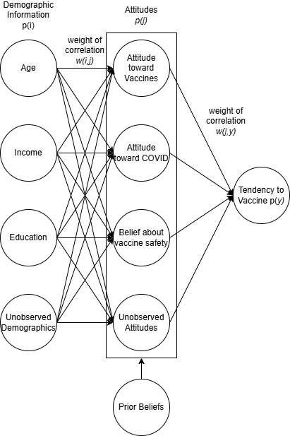
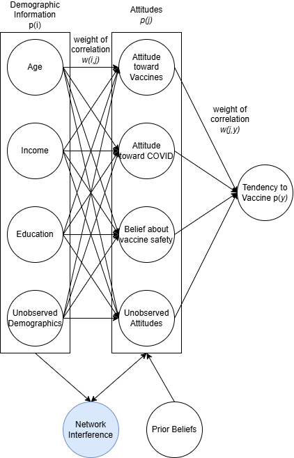
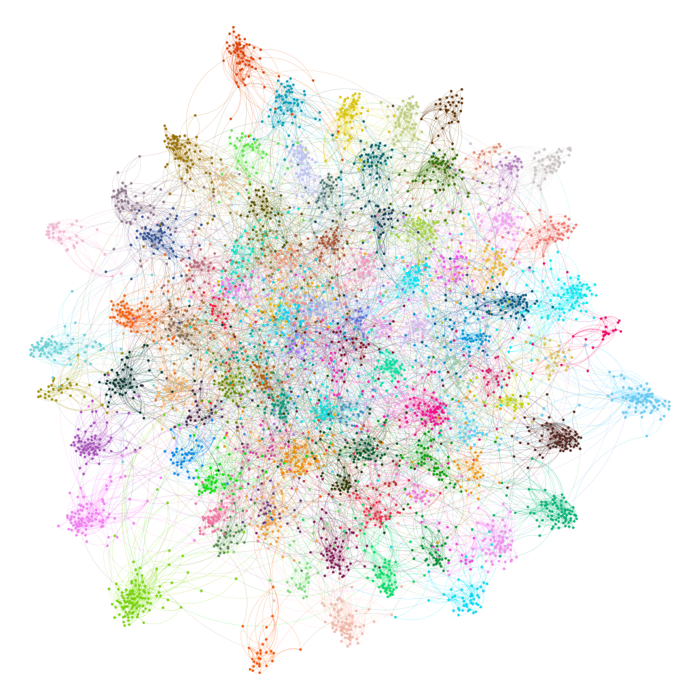
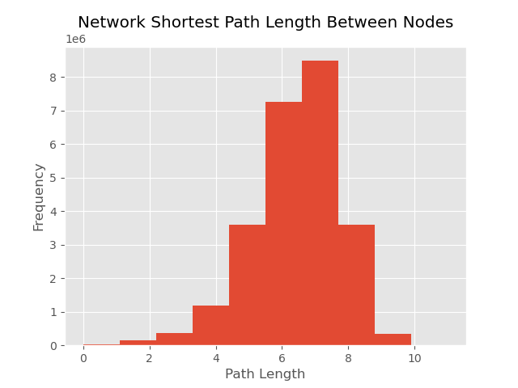
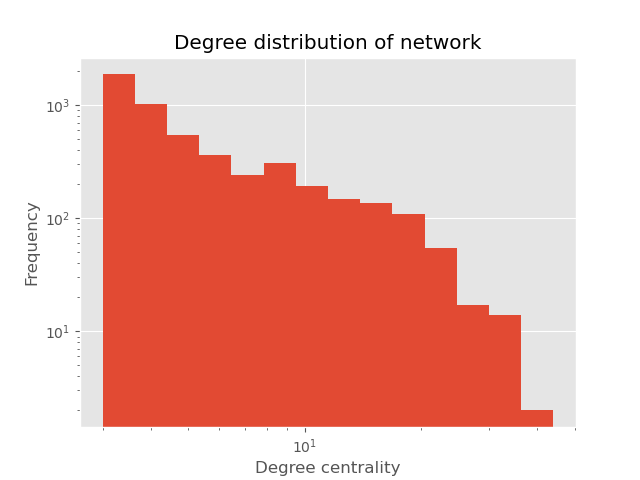
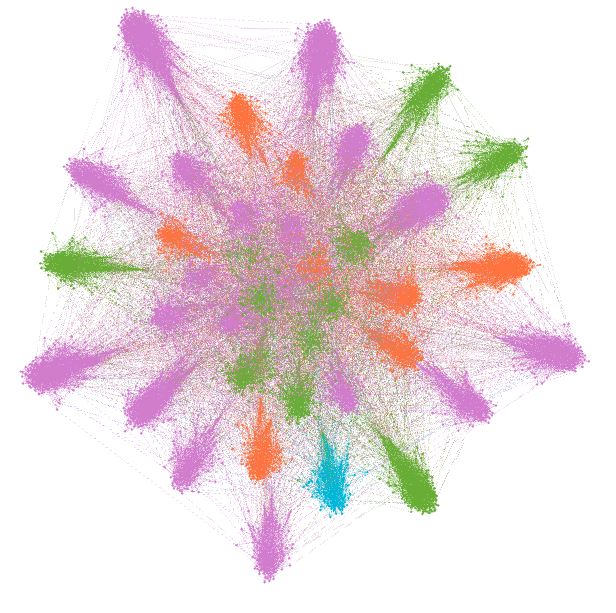
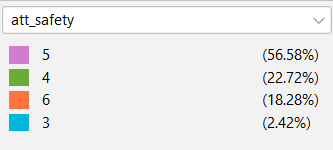
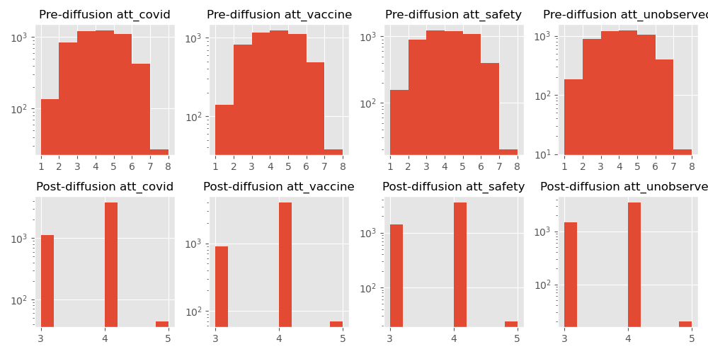
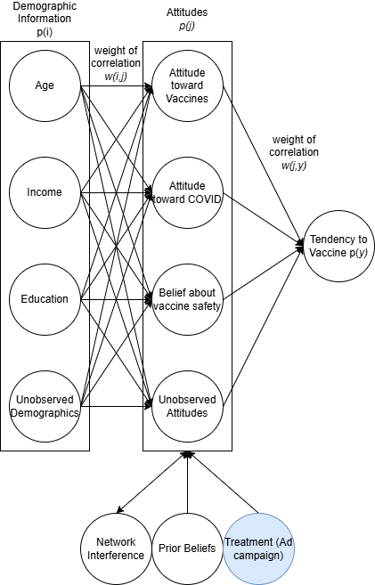

# Package Information

## Running the Code
Simply run all the code cells of `main.ipynb` in the order written. The code will draw on the necessary scripts and write to the necessary files.
- An overview of the data generation process can be found on this document but is implemented in `main.ipynb`.
- The analysis, visualizations, and commentary of the generated data can be found on `main.ipynb`

**Setting up the Environment:** If you already have a working python or Conda environment on your local machine, you may quickly install the packages used here, as listed in `requirements.txt`. Please see the [official guide](https://jupyter-notebook-beginner-guide.readthedocs.io/en/latest/) more information on setting up an environment on a local machine.

**Using Google Collab:** Alternatively, to run everything without installing an environment on your local machine, simply upload the entire repository folder to the root folder your google drive, open `main.ipynb` in [google collab](https://colab.research.google.com/), then uncomment and run the first cell to setup the google collab environment. Everything else will work in the same state.

## Package Composition
- `main.ipynb` contains all the code and analysis needed to run the project.
- `main.pdf` is a pdf printout of the notebook that provides a convenient visualization.
- `scripts` stores the various longer code files that the main notebook will draw on.
- `figures` stores the various visualizations generated. Some visualizations are generated with Gephi, with the raw gephi graph files included.
- `data` stores the simulated data in .csv format.

# Writeup - Behavioral Experiments with Network Interference

**Summary:** This project will simulate the results of different behavioral interventions while considering the networked nature of social media and network effects of COVID-19 vaccine advertisements. While behavioral experiments like this assume that the treatment does not affect the control group, this assumption might not hold in a highly networked system like social media where each individual's opinion might influence others'. Thus, by simulating an social media network structure made of tightly-connected communities and assigning treatments by community, this project will show how the behavioral experiment can only discover a conservative estimate of the treatment effect on the treated individuals. Given this simulated network structure and generative mechanism, only about 30% of the actual treatment effect is discovered.

This section will explain the rationale and mechanisms for generating the data and the underlying assumptions.

## Demographic Information

This project assumes that demographic information of the survey respondents are fully exogenous and representative of a hypothetical population.

|Field|Denotation|Generation Mechanism|References|
|--|--|--|--|
|`demographic_age`|Age in years|Empirical Distribution from Ages 18 to 84|[1]|
|`demographic_income`|Annual household income in thousands of dollars|$X \sim PowerLaw(3), Y = 526.2X, \implies Y \in [0,526.2]$|[2] [3] [4]|
|`demographic_education`|Highest educational degree obtained ('None - 8th grade', '9th - 11th grade', 'High school graduate',Some college, no degree', 'Associate's degree', 'Bachelor's degree','Master's degree', 'Professional degree', 'Doctoral degree')|Discrete empirical Distribution, where $X \in \{0,1,2,3,4,5,6,7,8\}$|[5]|
|`demographic_unobs_grp`|Simulates membership in an unobserved demographic group. This assumes that different dimensions of social identity can be compressed into low-dimensional approximations|$X \sim Uniform(\{A, B, C, D, E\})$||

One limitation of this model is that it incorrectly assumes that each demographic feature is independent of one another. Age, income, and education are all highly correlated in real life. However, this model is sufficient for this project's purposes of generating baseline attitudes towards vaccination.

## Attitudes Towards Vaccination

These related background questions will be generated by combining an individual's intrinsically held beliefs plus their demographic information, using the following formula and relationships:

$$p(j) = \Sigma_i{p(i)w(i,j)} + \beta + \epsilon$$
- Influence from demographics $\Sigma_i{p(i)w(i,j)}$, with:
    - Magnitude of influence of a demographic feature *i* on views $w(i.j) \in [0,1]$ and $\Sigma_i{w(i,j)}=1$
    - Value of a demographic feature normalized by standard deviation and maximum value $p(i) \in [0,2]$
- Intrinsically held belief $\beta \sim U(1,5)$
- Random error term $\epsilon \sim N(0,0.5)$

To make these values seem like survey responses, $p(j)$ will also be cleaned:
- In the rare case that this value exceeds the range (1,10) due to the random error term, the value will be assigned the closest value within the range (1,10)
- Each value will be rounded to the nearest integer to simulate survey responses

|Field|Description|Possible Responses|
|--|--|--|
|`att_covid`|How concerned are you about the COVID-19 pandemic?|1 (least concerned) - 10 (most concerned)|
|`att_vaccine`|In your view, how effective are COVID-19 vaccines?|1 (not effective at all) - 10 (highly effective)|
|`att_safety`|In your view, how safe are COVID-19 vaccines?|1 (not safe) - 10 (very safe)|
|`att_unobserved`|Other unobserved factors that influence one's attitude towards vaccination|1 (dislike vaccines) - 10 (like vaccines)|

Since these questions all measure qualitatively different opinions, the model will assume that responses to these questions are independent of each other.

## Network Component

To simulate the spread of vaccination attitudes in a social network, this component will simulate a facebook social network using a modified Bianconi–Barabási network that has following characteristics. Due to limited computational resources, this project assumes that this survey full captures a complete and self-contained facebook social network.

**Homophily:** People who are more demographically similar to each other are more likely to become friends with each other.
- This will be represented 100 communities, clustered together based on their demographic and vaccination attitudes (normalized based on standard deviation).
- The network will be strongly community-based, with individuals, all else equal, 1000 times more likely to form ties with an in-group member relative to an out-group member.
- The number of edges placed in the network will allow there to be relatively dense (0.7 density) in-group communities.

Examining the network, one can see that this algorithm has successfully a network with well formed communities. Furthermore, with a modularity of ~0.9, this means that 90% of the edges are within-community.

The graph below shows that all communities are fairly well-connected to each other. This means that each pair of nodes on the network is separated by no more than 10 degrees of separation

**Preferential Attachment:** People are more likely to make friends with people that are more popular. This is a common pattern in social and social media networks. [6] [7]
- To generate this Bianconi–Barabási network, we start with small cliques of fully connected nodes for each community. Each round, this algorithm add one node from each community *j*. The probability of node *j* connecting to another node already in the network *i* is:
$$p(i)=\frac{k(i)sim(i,j)}{\Sigma_i{k(i)sim(i,j)}}$$
- The denominator normalizes it into a probability $p(i) \in [0,1]$.
- $k(i)$ represents the number nodes already connected to *i*
- $sim(i,j) \in \{1,1000\}$ represents whether the two nodes are in the same community (i.e. homophily)

The degree distribution of the generated network suggests that it's drawn from a power-law distribution. Thus, one can confirm that there is indeed preferential attachment in this network.

**Attitude Diffusion:** This project will use Friedkin-Johnson diffusion to model the spread of norms across this network. Each person begins by holding a set of attitudes about COVID vaccination based on their intrinsically-held views. They then influence (and are influenced by) their friends' attitudes.
- After each period of time *t*, each node's new vaccination attitude is the weighted average of its own opinion, its neighbors' opinions, and its initial opinion. This process is repeated many times until each node's vaccination attitude converges to a stable value.
- This diffusion dynamic is run for infinite rounds until the network converges to a stable value. The final state of the network can be solved using the following equation:
$$ (I + L)^{-1}\vec{s} $$
- This is where *I* is the identity matrix, *L* is the laplacian of the network's adjacency matrix, and $\vec{s}$ is the vector representing individuals' starting attitudes. [8]
- This results in relatively uniform in-community adoption of a particular attitude towards vaccination.

After factoring in the attitude generation process and running attitude diffusion, one ends up with a low variance and slightly right-skewed distribution, where no value exceeds ten.

## Modelling Outcome Variable: the probability of vaccinating 
The probability of vaccinating will be calculated by using a weighted mean of their vaccination attitudes.
$$p(j) = \Sigma_i{p(j)w(j,y)} + \epsilon$$
- $\epsilon \sim N(0,0.5)$ refers to random error
- $w(j,y)$ refers to the relative weight given to each term, where $\Sigma_j{w(j,y)}=1$

## Modelling the Treatment Effect

This model assumes that treatments affect individual propensity to vaccinate through their attitudes about vaccination.

A individual's post-treatment vaccination attitudes $j_{post}$ can be defined by:

$$j_{post}= j_{pre} + \alpha * treat + \Sigma_i{\beta_i * treat} + \epsilon$$
- $\epsilon \sim N(0,0.5)$ refers to random error 
- *treat* is a binary variable denoting whether the individual is in the treated group.

**Base Effect:** Both treatments have a base effect of increasing a vaccination attitude by 3
- Hence, $\alpha = 3$

**Heterogenous Effect on Attitude:** Each treatment has an increased or diminished effect on a certain attitude
- Thus, $\beta_i \sim U(0,1)$

**Network Attitude Diffusion:** After the units are treated, individuals will again influence each other's opinions as time passes before an individual decides whether to vaccinate.
- This model assumes that the network structure has not changed and uses the same diffusion model.

**Random Block Assignment:** The two treatments will be assigned to entire communities at a time. This is to ensure that the treatment effect is observable and does not just make the whole network homogenous.
- Communities will receive either the emotion-based treatment, reason-based treatment, or be in the control group.
- Each treatment status will be assigned to 1/3 of the *communities*. Since not all communities are of the exact same size, not exactly 1/3 of individuals are assigned to each treatment status.

## Post-Generation Data Analysis

The analysis can be found in the second half of [`main.ipynb`](main.ipynb). The analysis is written in the jupyter notebook file so that it can draw on necessary data and visualizations.

## References (endnotes)

[1] Center for Disease Control, “Underlying Cause of Death, 2018-2023,” April 08, 2025, CDC WONDER Database, accessed April 10, 2025, https://wonder.cdc.gov/.

[2] D. G. Champernowne, “A Model of Income Distribution,” The Economic Journal 63, no. 250 (June 1953): 318, https://doi.org/10.2307/2227127.

[3] US Census Bureau, “Income in the United States: 2023,” Census.gov, accessed April 10, 2025, https://www.census.gov/library/publications/2024/demo/p60-282.html.

[4] Xavier Gabaix, “Power Laws in Economics: An Introduction,” Journal of Economic Perspectives 30, no. 1 (February 2016): 185–206, https://doi.org/10.1257/jep.30.1.185.

[5] US Census Bureau, “Educational Attainment of the Population 25 Years and Over, by Selected Characteristics,” Census.gov, 2022, https://www.census.gov/data/tables/2022/demo/educational-attainment/cps-detailed-tables.html.

[6] Chen Avin et al., “Mixed Preferential Attachment Model: Homophily and Minorities in Social Networks,” Physica A: Statistical Mechanics and Its Applications 555 (October 1, 2020): 124723, https://doi.org/10.1016/j.physa.2020.124723.

[7] “The Bianconi-Barabási Model,” in Network Science, by Albert-László Barabási and Márton Pósfai, 1st edition (Cambridge: Cambridge University Press, 2016).

[8] Jason Gaitonde, Jon Kleinberg, and Eva Tardos, “Adversarial Perturbations of Opinion Dynamics in Networks” (arXiv, July 13, 2020), https://doi.org/10.48550/arXiv.2003.07010.