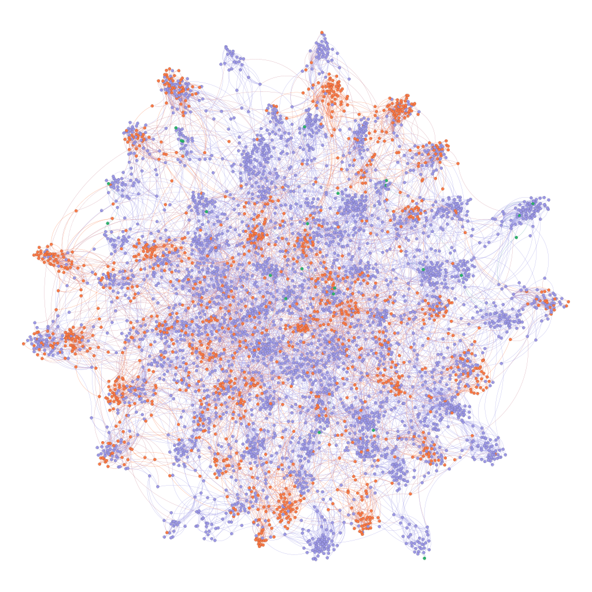

# Package Information

# Writeup 

This section will explain the rationale and mechanisms for generating the data and the underlying assumptions.

**Abstract:** This project will simulate the results of different COVID-19 interventions while considering the networked nature of social media and network effects of COVID-19 treatments.

## Demographic Information

    

    

        This project assumes that demographic information of the survey respondents are fully exogenous and representative of a hypothetical population. While this project understands that this is not necessarily representative of real-life populations, the generation mechanism will be predominately based on a uniform distribution for the sake of simplicity.
    

    

    

        
    

|Field|Denotation|Generation Mechanism|References|
|--|--|--|--|
|`demographic_age`|Age in years|$X \sim Uniform(21,80)$|
|`demographic_income`|Annual income in thousands of dollars|$X \sim PowerLaw(2), Y = 5 * 10^6X$|[1]|
|`demographic_education`|Highest educational degree obtained (no schooling, high school, bachelors or associates, postgraduate)|$X \sim Uniform (0,3)$|
|`demographic_unobs_grp`|Simulates membership in an unobserved demographic group. This assumes that different dimensions of social identity can be compressed into low-dimensional approximations|$X \sim Uniform(\{A, B, C, D, E\})$|

## Attitudes Towards Vaccination

These related background questions will be generated by combining an individual's intrinsically held beliefs plus their demographic information, using the following formula and relationships:

$$p(j) = \Sigma_i{p(i)w(i,j)} + \beta + \epsilon$$
- Influence from demographics $\Sigma_i{p(i)w(i,j)}$, with:
    - Magnitude of a demographic feature's influence on views $w(i.j) \in [0,1]$ and $\Sigma_i{w(i,j)}=1$
    - Value of a demographic feature normalized by standard deviation
- Intrinsically held belief $\beta \sim U(3,7)$
- Random error term $\epsilon \sim N(0,1)$

To make these values seem like survey responses, $p(j)$ will also be cleaned:
- In the rare case that this value exceeds the range (1,10) due to the random error term, the value will be forced back into the range
- Each value will be rounded to the nearest integer

|Field|Description|Possible Responses|Generation Mechanism|Relation to Outcome Variable|Source|
|--|--|--|--|--|
|`att_covid`|How concerned are you about the COVID-19 pandemic?|1 (least concerned) - 10 (most concerned)|||
|`att_vaccine`|In your view, how effective are COVID-19 vaccines?|1 (not effective at all) - 10 (highly effective)|||
|`att_safety`|In your view, how safe are COVID-19 vaccines?|1 (not safe) - 10 (very safe)|||
|`att_unobserved`|Other unobserved factors that influence one's propensity for vaccination|1(dislike vaccines) - 10 (like vaccines)|||

Since these questions all measure qualitatively different opinions, the model will assume that responses to these questions are independent of each other.

## Network Component

    

    

        To simulate the spread of vaccination behavior in a social network, this component will simulate a facebook social network using a modified Bianconi–Barabási network that has following characteristics. Due to limited computational resources, we assume that this survey full captures a complete and self-contained facebook social network.
    

    

    

        
    

**Homophily:** People who are more demographically similar to each other are more likely to become friends with each other.
- This will be represented 50 communities, clustered together based on their demographic and vaccination attitudes (normalized based on standard deviation).
- The network will be strongly community-based, with individuals, all else equal, 1000 times more likely to form ties with an in-group member relative to an out-group member.
- The number of edges placed in the network will allow there to be relatively dense (0.7 density) in-group communities.

**Preferential Attachment:** People are more likely to make friends with people that are more popular. This is a common pattern in social and social media networks. [2] [3]
- To generate this Bianconi–Barabási network, we start with a small clique of fully connected nodes from the same community. Each round, this algorithm add a node *j*. The probability of node *j* connecting to another node already in the network *i* is:
$$p(i)=\frac{k(i)sim(i,j)}{\Sigma_i{k(i)sim(i,j)}}$$
- The denomenator normalizes it into a probability $p(i) \in [0,1]$.
- $k(i)$ represents the number nodes already connected to *i*
- $sim(i,j) \in \{1,1000\}$ represents whether the two nodes are in the same community (i.e. homophily)

**Attitude Diffusion:** Each person begins by holding a set of attitudes about COVID vaccination based on their intrinsically-held views. They then influence (and are influenced by) their friends' attitudes.
- After each period of time *t*, each node's new vaccination attitude is the mean of itself and its friends' attitudes. This process is repeated many times until each node's vaccination attitude converges to a stable value.
- This results in relatively uniform in-community adoption of a particular attitude towards vaccination

## Modelling the Treatment Effect

This model assumes that treatments affect individual propensity to vaccinate through their attitudes about vaccination.

A individual's post-treatment vaccination attitudes $y_{post}$ can be defined by:

$$y_{post}= y_{pre} + [\alpha (treat) + \Sigma_i{\beta_i (treat * demographic_i)} + \epsilon]\frac{15 - y_{pre}}{10} $$
- $\epsilon \sim N(0,0.5)$ refers to random error 

**Base Effect:** Both treatments have a base effect of increasing vaccination attitude by 1
- Hence, $\alpha = 1$

**Heterogenous Effect:** Each treatment has an increased or diminished effect on certain demographic groups
- Thus, $\beta_i \sim U(0,0.5)
- *demographic_i* refers to the demographic normalized by its standard deviation

**Diminishing Returns:** This model linearly scales down the effect of treatment if the individual already holds a pro-vaccine attitude
|Prexisting attitude|Effect size scaling factor|
|--|--|
|3|1.4|
|4|1.2|
|5|1.0|
|6|0.8|
|7|0.6|

**Random Treatment Assignment:** The two treatments will be assigned to random units, without consideration of the network structure.

**Network Interference:** After the units are treated, individuals will again influence each other as time passes before an individual decides whether to vaccinate.
- Thus, the 
- This model assumes that the network structure has not changed

## Modelling Outcome Variable: the probability of to vaccinate
The probability of vaccinating will be calculated by their attitudes
$$p(j) = \Sigma_i{p(i)w(i,j)} + \epsilon$$
- $\epsilon \sim N(0,0.1)$ refers to random error 
- $w(i,j)$ refers to the relative weight given to each term, where $\Sigma_i{w(i,j)}=1$

## Appendieces

## References (endnotes)

[1] D. G. Champernowne, “A Model of Income Distribution,” The Economic Journal 63, no. 250 (June 1953): 318, https://doi.org/10.2307/2227127.

[2] Chen Avin et al., “Mixed Preferential Attachment Model: Homophily and Minorities in Social Networks,” Physica A: Statistical Mechanics and Its Applications 555 (October 1, 2020): 124723, https://doi.org/10.1016/j.physa.2020.124723.

[3] “The Bianconi-Barabási Model,” in Network Science, by Albert-László Barabási and Márton Pósfai, 1st edition (Cambridge: Cambridge University Press, 2016).

[4]