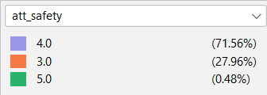

# Package Information

## Running the Code
Simply run all the code cells of `main.ipynb` in the order written. The code will draw on the necessary scripts and write to the necessary files.

**Dependencies** can be found in `requirements.txt`. However, to run everything without installing a custom environment, simply navigate to the google collab file setup for this purpose..

## Package Composition
- `scripts` stores the various longer code files that the program will draw on
- `figures` stores the various visualizations generated. Some visualizations are generated with Gephi, with the raw gephi graph files included.
- `data` stores the .csv files used in the analysis.

# Writeup 

This section will explain the rationale and mechanisms for generating the data and the underlying assumptions.

**Abstract:** This project will simulate the results of different COVID-19 interventions while considering the networked nature of social media and network effects of COVID-19 treatments.

## Demographic Information

This project assumes that demographic information of the survey respondents are fully exogenous and representative of a hypothetical population. While this project understands that this is not necessarily representative of real-life populations, the generation mechanism will be predominately based on a uniform distribution for the sake of simplicity.

|Field|Denotation|Generation Mechanism|References|
|--|--|--|--|
|`demographic_age`|Age in years|Empirical Distribution from Ages 18 to 84|[1]|
|`demographic_income`|Annual household income in thousands of dollars|$X \sim PowerLaw(3), Y = 526.2X, \implies Y \in [0,526.2]$|[2] [3] [4]|
|`demographic_education`|Highest educational degree obtained ('None - 8th grade', '9th - 11th grade', 'High school graduate',Some college, no degree', 'Associate's degree', 'Bachelor's degree','Master's degree', 'Professional degree', 'Doctoral degree')|Discrete empirical Distribution, where $X \in \{0,1,2,3,4,5,6,7,8\}$|[5]|
|`demographic_unobs_grp`|Simulates membership in an unobserved demographic group. This assumes that different dimensions of social identity can be compressed into low-dimensional approximations|$X \sim Uniform(\{A, B, C, D, E\})$||

One limitation of this model is that it incorrectly assumes that each demographic feature is independent of one another. Age, income, and education are all highly correlated in real life. However, this model is sufficient for this project's purposes of generating baseline attitudes towards vaccination.

## Attitudes Towards Vaccination

These related background questions will be generated by combining an individual's intrinsically held beliefs plus their demographic information, using the following formula and relationships:

$$p(j) = \Sigma_i{p(i)w(i,j)} + \beta + \epsilon$$
- Influence from demographics $\Sigma_i{p(i)w(i,j)}$, with:
    - Magnitude of influence of a demographic feature *i* on views $w(i.j) \in [0,1]$ and $\Sigma_i{w(i,j)}=1$
    - Value of a demographic feature normalized by standard deviation and maximum value $p(i) \in [0,2]$
- Intrinsically held belief $\beta \sim U(1,5)$
- Random error term $\epsilon \sim N(0,0.5)$

This ensures that we have values that will most likely not exceed 10

To make these values seem like survey responses, $p(j)$ will also be cleaned:
- In the rare case that this value exceeds the range (1,10) due to the random error term, the value will be assigned the closest value within the range (1,10)
- Each value will be rounded to the nearest integer to simulate survey responses

|Field|Description|Possible Responses|
|--|--|--|
|`att_covid`|How concerned are you about the COVID-19 pandemic?|1 (least concerned) - 10 (most concerned)|
|`att_vaccine`|In your view, how effective are COVID-19 vaccines?|1 (not effective at all) - 10 (highly effective)|
|`att_safety`|In your view, how safe are COVID-19 vaccines?|1 (not safe) - 10 (very safe)|
|`att_unobserved`|Other unobserved factors that influence one's attitude towards vaccination|1(dislike vaccines) - 10 (like vaccines)|

Since these questions all measure qualitatively different opinions, the model will assume that responses to these questions are independent of each other.

## Network Component

To simulate the spread of vaccination attitudes in a social network, this component will simulate a facebook social network using a modified Bianconi–Barabási network that has following characteristics. Due to limited computational resources, we assume that this survey full captures a complete and self-contained facebook social network.

**Homophily:** People who are more demographically similar to each other are more likely to become friends with each other.
- This will be represented 50 communities, clustered together based on their demographic and vaccination attitudes (normalized based on standard deviation).
- The network will be strongly community-based, with individuals, all else equal, 1000 times more likely to form ties with an in-group member relative to an out-group member.
- The number of edges placed in the network will allow there to be relatively dense (0.7 density) in-group communities.

**Preferential Attachment:** People are more likely to make friends with people that are more popular. This is a common pattern in social and social media networks. [6] [7]
- To generate this Bianconi–Barabási network, we start with a small clique of fully connected nodes from the same community. Each round, this algorithm add a node *j*. The probability of node *j* connecting to another node already in the network *i* is:
$$p(i)=\frac{k(i)sim(i,j)}{\Sigma_i{k(i)sim(i,j)}}$$
- The denomenator normalizes it into a probability $p(i) \in [0,1]$.
- $k(i)$ represents the number nodes already connected to *i*
- $sim(i,j) \in \{1,1000\}$ represents whether the two nodes are in the same community (i.e. homophily)

**Attitude Diffusion:** This will use Friedkin-Johnson diffusion to model the spread of norms across this network. Each person begins by holding a set of attitudes about COVID vaccination based on their intrinsically-held views. They then influence (and are influenced by) their friends' attitudes.
- After each period of time *t*, each node's new vaccination attitude is the weighted average of its own opinion, its neighbors' opinions, and its initial opinion. This process is repeated many times until each node's vaccination attitude converges to a stable value.
- This diffusion dynamic is run for infinite rounds until the network converges to a stable value. The final state of the network can be solved using the following equation:
$$ (I + L)^{-1}\vec{s} $$
- This is where *I* is the identity matrix, *L* is the laplacian of the network's adjacency matrix, and $\vec{s}$ is the vector representing individuals' starting attitudes. [8]
- This results in relatively uniform in-community adoption of a particular attitude towards vaccination.

## Modelling Outcome Variable: the probability of to vaccinate
The probability of vaccinating will be calculated by their attitudes
$$p(j) = \Sigma_i{p(i)w(i,j)} + \epsilon$$
- $\epsilon \sim N(0,0.5)$ refers to random error
- $w(i,j)$ refers to the relative weight given to each term, where $\Sigma_i{w(i,j)}=1$

## Modelling the Treatment Effect

This model assumes that treatments affect individual propensity to vaccinate through their attitudes about vaccination.

A individual's post-treatment vaccination attitudes $y_{post}$ can be defined by:

$$y_{post}= y_{pre} + \alpha * treat + \Sigma_i{\beta_i * treat} + \epsilon$$
- $\epsilon \sim N(0,0.5)$ refers to random error 

**Base Effect:** Both treatments have a base effect of increasing a vaccination attitude by 3
- Hence, $\alpha = 3$

**Heterogenous Effect on Attitude:** Each treatment has an increased or diminished effect on a certain attitude
- Thus, $\beta_i \sim U(0,1)$

**Network Interference:** After the units are treated, individuals will again influence each other as time passes before an individual decides whether to vaccinate.
- This model assumes that the network structure has not changed and uses the same diffusion model.

**Random Block Assignment:** The two treatments will be assigned to entire communities at a time. This is to ensure that the treatment effect is observable and does not just make the whole network homogenous.
- Communities will have equal probability of recieving the emotion-based treatment, reason-based treatment, and control group.

## Post-Generation Analysis

The analysis can be found in the second half of [`main.ipynb`](main.ipynb). It is written in the jupyter notebook file so that the commentary can draw on necessary data and visualizations.

## References (endnotes)

[1] Center for Disease Control, “Underlying Cause of Death, 2018-2023,” April 08, 2025, CDC WONDER Database, accessed April 10, 2025, https://wonder.cdc.gov/.

[2] D. G. Champernowne, “A Model of Income Distribution,” The Economic Journal 63, no. 250 (June 1953): 318, https://doi.org/10.2307/2227127.

[3] US Census Bureau, “Income in the United States: 2023,” Census.gov, accessed April 10, 2025, https://www.census.gov/library/publications/2024/demo/p60-282.html.

[4] Xavier Gabaix, “Power Laws in Economics: An Introduction,” Journal of Economic Perspectives 30, no. 1 (February 2016): 185–206, https://doi.org/10.1257/jep.30.1.185.

[5] US Census Bureau, “Educational Attainment of the Population 25 Years and Over, by Selected Characteristics,” Census.gov, 2022, https://www.census.gov/data/tables/2022/demo/educational-attainment/cps-detailed-tables.html.

[6] Chen Avin et al., “Mixed Preferential Attachment Model: Homophily and Minorities in Social Networks,” Physica A: Statistical Mechanics and Its Applications 555 (October 1, 2020): 124723, https://doi.org/10.1016/j.physa.2020.124723.

[7] “The Bianconi-Barabási Model,” in Network Science, by Albert-László Barabási and Márton Pósfai, 1st edition (Cambridge: Cambridge University Press, 2016).

[8] Jason Gaitonde, Jon Kleinberg, and Eva Tardos, “Adversarial Perturbations of Opinion Dynamics in Networks” (arXiv, July 13, 2020), https://doi.org/10.48550/arXiv.2003.07010.